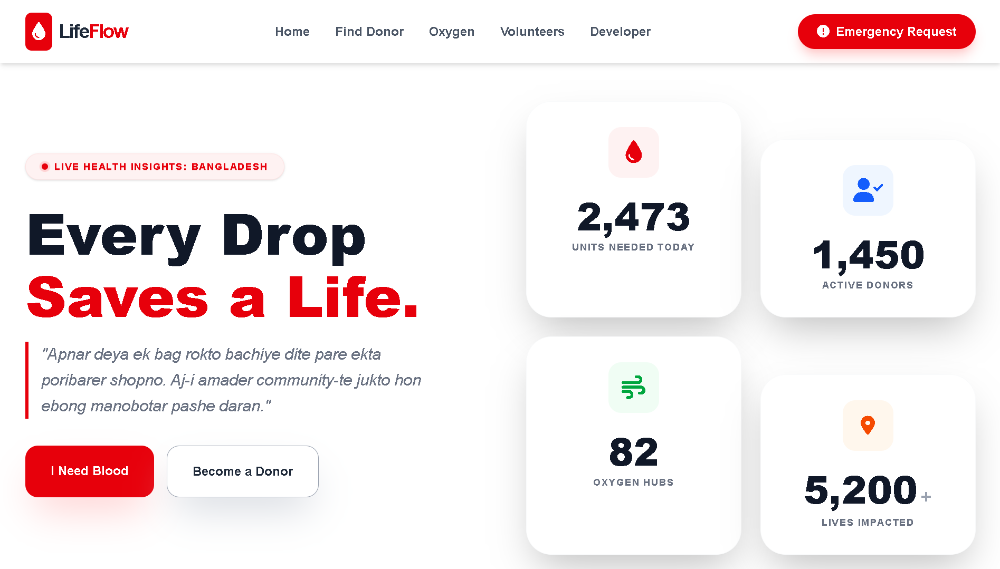
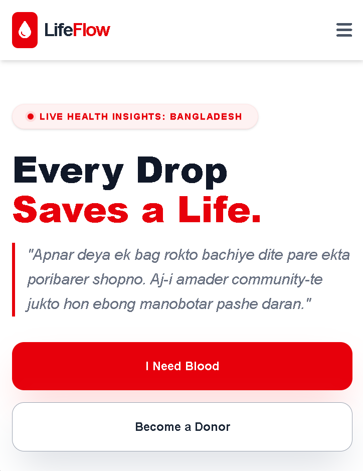

<div align="center">


<br />

[](#)
[](#)
[](#)

<p align="center">
  <strong>Connecting Lives, Delivering Hope.</strong><br>
  A centralized platform to find blood donors, oxygen suppliers, and local volunteers in emergencies.
</p>

</div>

---

## 👀 Project Preview

Add a screenshot of your current frontend design here to showcase the UI.

| **Desktop View** | **Mobile View (App Style)** |
|:---:|:---:|
|  |  |

> *https://atul-dev-ai.github.io/LifeFLow*

<br />

## 📖 About LifeFlow

In critical medical situations, finding resources quickly is a huge challenge. **LifeFlow** aims to solve this by providing a clean and fast interface to connect seekers with donors and suppliers. 

Currently, this is a **Frontend-only** project focused on delivering a high-quality User Experience (UX) using modern web technologies.

## ✨ Core Features

| Feature | Description |
| :--- | :--- |
| 🩸 **Blood Donor Network** | Easily search for donors by specific blood group and immediate location. |
| 💨 **Oxygen Supply Tracker** | Quickly locate nearby verified oxygen cylinder suppliers and get contact info. |
| 🤝 **Volunteer Hub** | Connect with local heroes ready to assist in community emergencies or personal crises. |
| 📱 **Fully Responsive** | Optimized specifically for mobile devices to ensure accessibility on the go. |

---

## 🛠️ Current Tech Stack (Frontend)

This version of the project focuses heavily on the User Interface and User Experience, built with modern tooling:

*  **HTML5:** For semantic and accessible structure.
*  **Tailwind CSS:** For a sleek, rapid, and utility-first styling approach.
*  **Vanilla JavaScript:** For handling interactive UI components.


---

## 🚀 The Road to Full-Stack (Future Roadmap)

While LifeFlow is currently a stunning frontend interface, it is actively transitioning into a powerful **Full-Stack Application**. The upcoming architecture will make the platform fully dynamic and data-driven.

**Upcoming Backend Integration:**
- [ ] **Framework:** Python (Flask) for robust API development and backend logic.
- [ ] **Database:** MongoDB for flexible, scalable, and fast data storage (users, donors, requests).
- [ ] **Authentication:** Secure User Login/Signup and role-based access (Admin, Donor, User).
- [ ] **Real-Time Data:** Dynamic rendering of donor lists and live status updates for oxygen availability.
- [ ] **Automated Alerts:** Notifications for urgent requests in the user's vicinity.

## 💻 Getting Started (Local Setup)

Want to explore the UI or contribute to the frontend? It's simple to run locally:

1. **Clone the repository:**
   ```bash
     git clone https://github.com/atul-dev-ai/LifeFLow.git
   ```
2. **Navigate to the directory:**

```Bash
    cd LifeFlow
```
3. **Run the project:**
  *⚠️ **Note:**  Simply open `index.html` in your favorite web browser, or use the Live Server extension in VS Code for real-time reloading.*

---

## 🤝 Contributing

Contributions are welcome! If you want to add features like "Face Detection" or "Log Recording":

1.  Fork the Project.
2.  Create your Feature Branch (`git checkout -b feature/AmazingFeature`).
3.  Commit your Changes (`git commit -m 'Add some AmazingFeature'`).
4.  Push to the Branch (`git push origin feature/AmazingFeature`).
5.  Open a Pull Request.

---

## 👨‍💻 Author

**Atul Paul**

 **GitHub:** [@atul-dev-ai](https://github.com/atul-dev-ai)
 
 **Portfolio:** [atulpaul.vercel.app](https://atulpaul.vercel.app)
 
 **Email:** paulatul020@gmail.com

